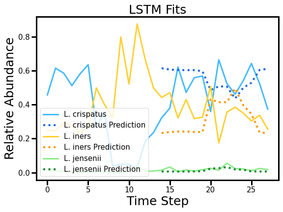
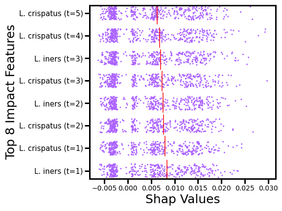

# Modeling Microbiota: Using LSTM to Study Vaginal Dynamics
This is the official GitHub repository for Modeling Microbiota: Using LSTM to Study Vaginal Dynamics for the 37th 2023 AAAI student track conference. This contains the full code for the tool to analyze community microbial interactions. Furthermore, this repository includes the necessary dataset and trained model as used within the paper to replicate all work shown in the paper.

The full code to train your own model can be found within the jupyter notebook labelled  containing the tuned hyperparameters, and the data parser can be found within data_parsing.py to reparse the data from the cleaned up file VMBData_clean.xlsx representing data from <a href="https://journals.asm.org/doi/10.1128/mSphere.00593-20">Daily Vaginal Microbiota Fluctuations Associated with Natural Hormonal Cycle, Contraceptives, Diet, and Exercise</a> by Stephanie D. Song, Kalpana D. Acharya, Jade E. Zhu, Christen M. Deveney, Marina R. S. Walther-Antonio, Marc J. Tetel, and Nicholas Chia. However, for convenience we have included the parsed data in train_test_sequences.pickle.  is the jupter notebook containing everything necessary to replicate the results found in the paper using the same trained model as the paper. Both jupyter notebooks are ready to run with GoogleColab with a single click.

This tool aims to accurately model microbial community interactions using an LSTM and take Explainability AI methods such as <a href="https://proceedings.neurips.cc/paper/2017/hash/8a20a8621978632d76c43dfd28b67767-Abstract.html">SHAP (SHapley Additive exPlanations)</a> to gain insight into microbial community interactions with useful visual interpretations.

Above is a sample plot of the best fits on the test example by the trained LSTM used in the paper. The solid lines are the true data, while the dotted lines are the LSTM's outputs. The LSTM starts outputting predicted values from the 15th to the 28th time steps with the first 14 time steps as the initial input data using the testing scheme explained in the paper. This plot uses normalized values for the relative abundances and only demonstrates 3 of the 15 species.

Above is another sample plot demonstrating the explanation for the model's weights given to different inputs for predicting *L. crispatus*. This plot demonstrates the top 8 average highest distinct features, meaning distinct time step and species, impacting the predictions of the LSTM for *L. crispatus* across the entire training dataset. The scatter plot has the SHAP values on the x-axis demonstrating the impact of the particular feature while the feature is plotted on the y-axis with jitter to help visualize point density. Furthermore, each feature has  a vertical red line symbolizing the mean absolute value SHAP value.
